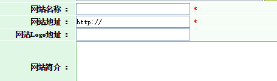
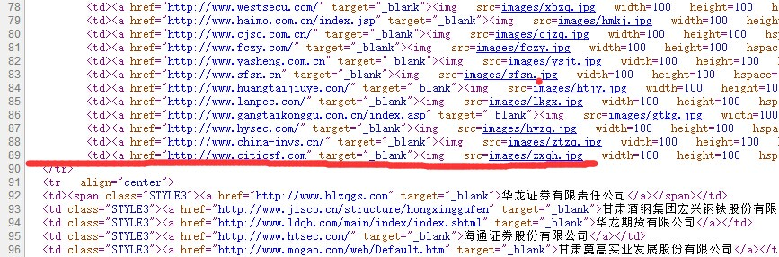
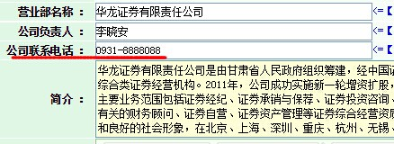
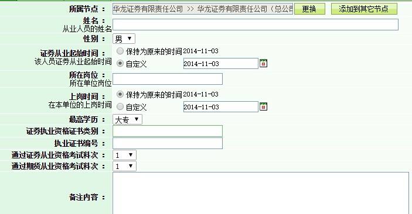

### 维护和统筹管理问题
对于这个问题，我在第一章第二节对**网站维护不够便捷**做了四个方面的分享。
协会现有网站语言功能的限制，网站的维护多靠花费很多时间进行网站页面的修改和更新，这在很大一部分程度上降低了工作效率，此次需要系统上进行完善，使网站维护和更新上变得便利和高效。
目前对于协会有一些系统功能已经得到了开发，简单展示。

### 维护更方便了 ##
假如在网站页面对：图片新闻、协会机构名录、会员地图进行添加维护内容。

**现在**我们这样做：
>

**以前**：我们这样做：

第一步，组织和编写代码，不能有错误

``` <a href="http://www.gsstock.com/" target="_blank">
</a> ```

第二步，在杂乱的代码中找到合适的位置，理解代码的含义，在89行和143行分别加入以上代码。
>


可以看出，这样做既方便，而且不容易出错，提高了工作效率。


### 数据保存更加方便了 ##
>例如华龙证券公司要进行电话号码变更,我们只需要找到华龙证券公司的目录
>点击修改，进入以下界面。
>

#### 从业人员简介录入 ##
>对于从业人员的简介和公示有经常的变动，在后台数据中进行系统的分类和管理是很有必要的。
>图如：我们以地域为分类-进入栏目》甘肃》兰州》华龙证券有限责任公司》华龙证券有限责任公司（总公司）右键，可以添加新的从业人员
>
>

#### 更多的功能 ##
如在文章管理 权限分配 数据管理 数据调运 自定义模块等方面都有成熟和方便的操作，仅先例举以上三条做参考。
